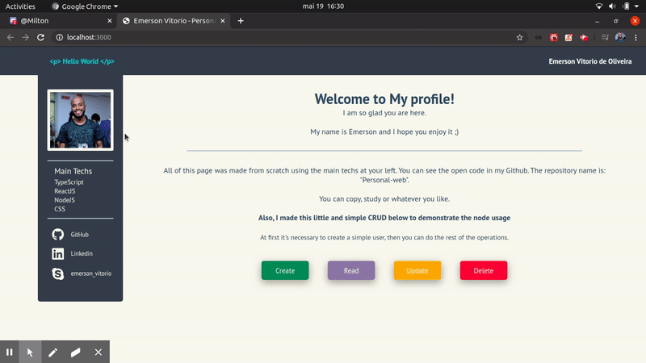
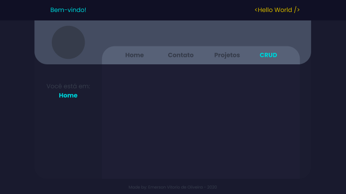

I've been working on it from scratch to improve my knowledge and to training the JS Stack: React, Node and it's ecosystem. 
Althoug I already have the back-end to put in the website, I didn't yet because I'm still working on security.

My plan incluses let this public for everyone who wants to learn on it.

Take a look how it looks like for now:

Aftter a while I made this second version (preview only) that I'll start develop as soon as I finish some stuffs:

That's it!

